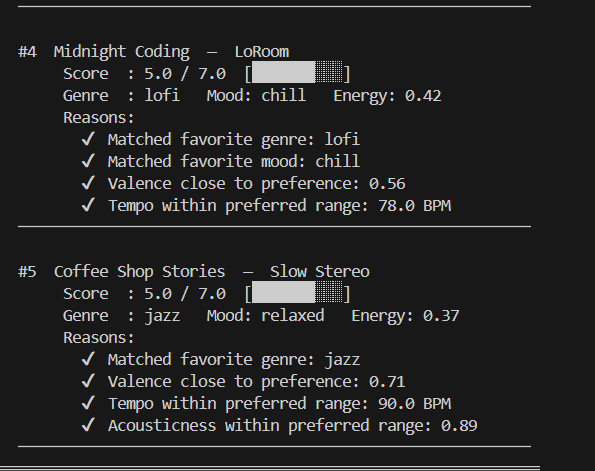

# 🎵 Music Recommender Simulation

## Project Summary

In this project you will build and explain a small music recommender system.

Your goal is to:

- Represent songs and a user "taste profile" as data
- Design a scoring rule that turns that data into recommendations
- Evaluate what your system gets right and wrong
- Reflect on how this mirrors real world AI recommenders

Replace this paragraph with your own summary of what your version does.

---

## How The System Works

Real world recommendations work by combining user behavior like the songs they listen to, whether they skip or save the song.This also looks at the mood of the song lyrics the user likes and gives song recommendations of the same mood. This relies on different features like genre and even the artist that the user likes to listen to. My version will prioritize using features genre, mood, energy, tempo_bpm, valence, danceability and acousticness to predict a user's preferred music type.

Explain your design in plain language.

The first step Input collects the user's profile like favorite genres, moods, and energy music they prefer. Then for each song in the CSV dataset, this will compare all the songs with the user's preferences and each song will get scored based on how well it matches the user's profile. After scoring every song, the system sorts the scores from greatest to lowest and returns the top scores for user recommendations. For the "Algorithmic Recipe" the system will prioritize the genre song's than any of the other features.

Some prompts to answer:

- What features does each `Song` use in your system
  - For example: genre, mood, energy, tempo

The features each `Song` will use are genre, mood, energy, tempo_bpm, valence, danceability and acousticness.

- What information does your `UserProfile` store

This should store the user's preferences like preferred genres, mood and values for the numerical features.

- How does your `Recommender` compute a score for each song
- How do you choose which songs to recommend

You can include a simple diagram or bullet list if helpful.

---

## Getting Started

### Setup

1. Create a virtual environment (optional but recommended):

   ```bash
   python -m venv .venv
   source .venv/bin/activate      # Mac or Linux
   .venv\Scripts\activate         # Windows

2. Install dependencies

```bash
pip install -r requirements.txt
```

3. Run the app:

```bash
python -m src.main
```

### Running Tests

Run the starter tests with:

```bash
pytest
```

You can add more tests in `tests/test_recommender.py`.

---

## Experiments You Tried

Use this section to document the experiments you ran. For example:

- What happened when you changed the weight on genre from 2.0 to 0.5
- What happened when you added tempo or valence to the score
- How did your system behave for different types of users

---

When I changed the genre value, the genre feature stopped dominating the scoring rank. The recommendations became more mixed rather than just mainly relying on genre. When I added tempo and valence to the score the score ranking became much more stable. The system would give points based on whether the recommended song matches the features for the users preferences and the more points meant the user wold most likely prefer that song.

## Limitations and Risks

Summarize some limitations of your recommender.

Examples:

- It only works on a tiny catalog
- It does not understand lyrics or language
- It might over favor one genre or mood

You will go deeper on this in your model card.

---

During my experiments I noticed how the feature energy is dominating and the score given for the songs closely relates to that. Users are also getting the same style since genre and mood are technically around the same for most users in the dataset.

## Reflection

Read and complete `model_card.md`:

[**Model Card**](model_card.md)

Write 1 to 2 paragraphs here about what you learned:

- about how recommenders turn data into predictions
- about where bias or unfairness could show up in systems like this


---

I learned how important it is to have every feature treated the same in which one feature should not be overpowering another feature. The problem if that happens is that the song recommendations may not fully align with what the user wants and the output would be biased since this would get the top 5 songs based on that one feature. If the model features are used equally then the model can use these features to make proper predictions on the users preferred music and figure out what songs a user would like.

## 7. `model_card_template.md`

Combines reflection and model card framing from the Module 3 guidance. :contentReference[oaicite:2]{index=2}  

```markdown
# 🎧 Model Card - Music Recommender Simulation

## 1. Model Name

Give your recommender a name, for example:

> VibeFinder 1.0

---

Model Name: CoolSongRecommender

## 2. Intended Use

- What is this system trying to do
- Who is it for

Example:

> This model suggests 3 to 5 songs from a small catalog based on a user's preferred genre, mood, and energy level. It is for classroom exploration only, not for real users.

---

My recommender is designed to generate the top 5 songs that best matches the user's song preferences. This is intended for testing and seeing whether the model would be ready to make predictions on users preferences. This uses multiple features to find user's preference songs and give a score with the reasons as to why the user would prefer this song lyrics.

## 3. How It Works (Short Explanation)

Describe your scoring logic in plain language.

- What features of each song does it consider
- What information about the user does it use
- How does it turn those into a number

Try to avoid code in this section, treat it like an explanation to a non programmer.

---

The features I used were genre, mood, energy, tempo_bpm, valence, danceability and acousticness. My dataset had 18 rows that also mention the title and artist of the song. The model turns this into a score by checking whether the recommendation matches the users preferred genre, mood and numeric ranges. Each match would add points to the recommended song score and the top 5 songs with the highest scores are displayed as recommendations. I added more features to the code to check to make sure that the there wasn't a dominant feature that would display the song recommendations. I also alternated the score like making genre match 1 point instead of 2 to see if the ranking behavior would change.

## 4. Data

Describe your dataset.

- How many songs are in `data/songs.csv`
- Did you add or remove any songs
- What kinds of genres or moods are represented
- Whose taste does this data mostly reflect

---

The model used the songs.csv dataset. There were 10 songs and later I added 8 more songs to the dataset. There was pop, lofi, rock, ambient, jazz, etc for genre feature and happy, chill, intense, relaxed, etc for mood feature. I don't see anything really missing from the dataset.

## 5. Strengths

Where does your recommender work well

You can think about:
- Situations where the top results "felt right"
- Particular user profiles it served well
- Simplicity or transparency benefits

---

Most users prefer chill and excited mood songs as well as pop and lofi for genre and for this the recommended song choices were really good choices that fit well with this criteria. The score is successfully counting and number of matches from the recommended song to the users preferences giving high scores with explanations to the reason for that score.

## 6. Limitations and Bias

Where does your recommender struggle

Some prompts:
- Does it ignore some genres or moods
- Does it treat all users as if they have the same taste shape
- Is it biased toward high energy or one genre by default
- How could this be unfair if used in a real product

---

During my experiments I noticed how the feature energy is dominating and the score given for the songs closely relates to that. Users are also getting the same style since genre and mood are technically around the same for most users in the dataset. Some preference fields like artist_preferences and target_energy are not always used for scoring so the results may be inaccurate. It seems like the scoring is overrepresenting some features and underrepresenting the others.

## 7. Evaluation

How did you check your system

Examples:
- You tried multiple user profiles and wrote down whether the results matched your expectations
- You compared your simulation to what a real app like Spotify or YouTube tends to recommend
- You wrote tests for your scoring logic

You do not need a numeric metric, but if you used one, explain what it measures.

---

I created a songsTest.py file and wrote different edge cases to check whether my rankings made sense. For user profile did 2 experiments as well to where I doubled the points for energy and reduced the points for genre to see if a feature was being more dominate than the other. What surprised me was that energy had a stronger impact on the scoring and some preference fields had little to no effect for the scoring criteria.

## 8. Future Work

If you had more time, how would you improve this recommender

Examples:

- Add support for multiple users and "group vibe" recommendations
- Balance diversity of songs instead of always picking the closest match
- Use more features, like tempo ranges or lyric themes

---

I would try to balance the metric for the users preference for songs so that way the model can successfully find the recommended songs that fits the full criteria for the user. I would have the model go through testing and test edge cases and if there's failure in the edge cases I may add another feature or make changes to the model so the edge case works successfully.

## 9. Personal Reflection

A few sentences about what you learned:

- What surprised you about how your system behaved
- How did building this change how you think about real music recommenders
- Where do you think human judgment still matters, even if the model seems "smart"

I learnt how even though it may seem that the system worked successfully and the top 5 song recommendations came out with good explanations for the scoring, there may be some bias the model undergoes when looking through the features. I noticed that the energy was the most dominant feature and the model would mostly rely on that to find top recommendations. This has made me realized that it is important to create test cases for the model in which creating edge cases helps to make sure the model is fairly selecting top recommendation songs. If the edge cases fail, this proves that the model didn't do the scoring properly.


